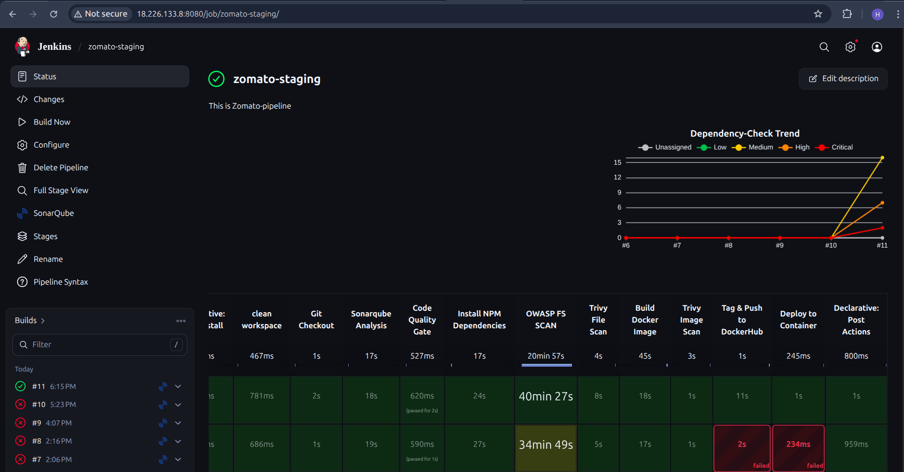
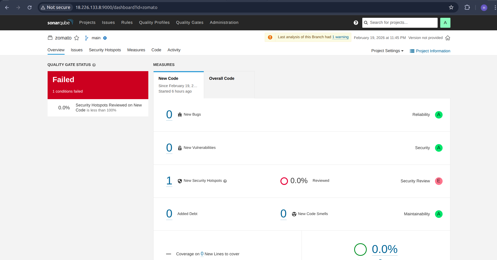
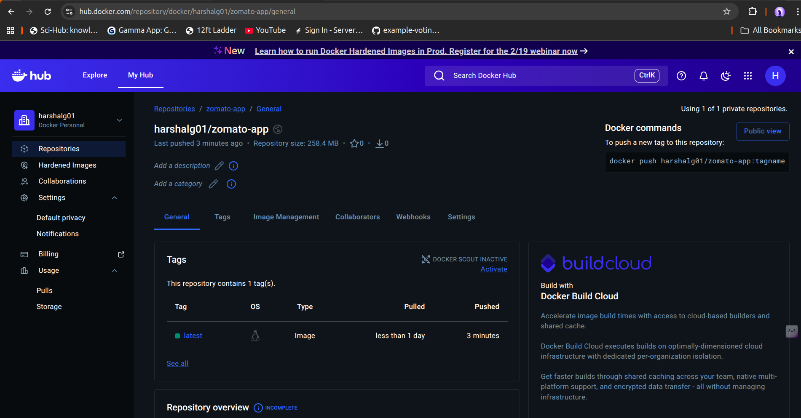
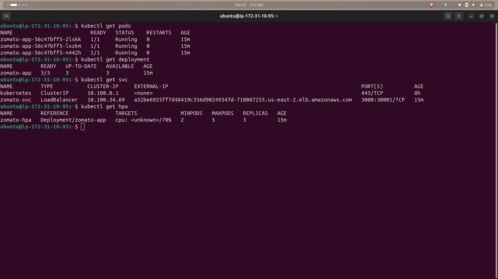
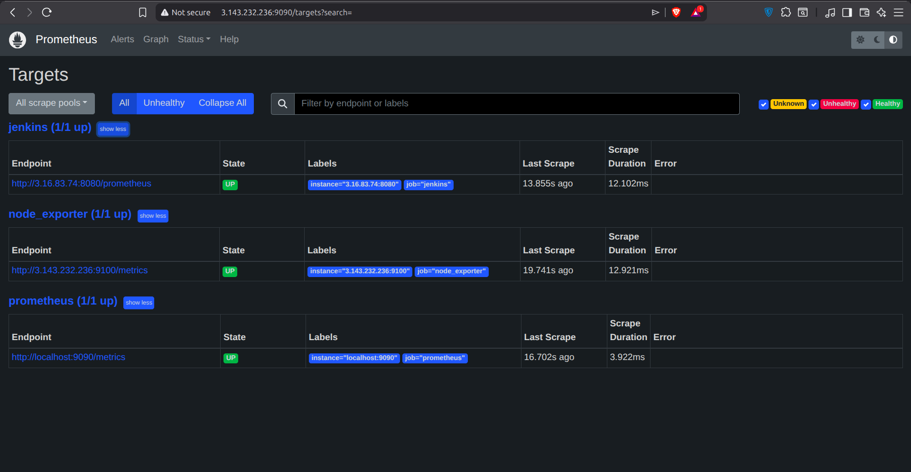
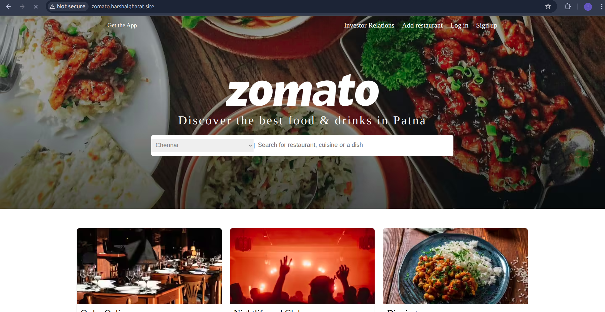

# 🍔 Online Food Ordering & Delivery Application  
## 🚀 Production-Grade DevSecOps Implementation on AWS EKS


---

# 📌 Project Overview

This project demonstrates a **production-ready DevSecOps pipeline** for an Online Food Ordering & Delivery Application deployed on AWS.

It implements:

- CI/CD automation using Jenkins
- Integrated security scanning (SonarQube, OWASP, Trivy)
- Docker-based containerization
- Kubernetes deployment on Amazon EKS
- Horizontal Pod Autoscaling (HPA)
- Monitoring using Prometheus & Grafana
- Custom domain mapping using Route 53

This project simulates a real-world cloud production deployment environment.

---

# ⭐ Key Features

- End-to-End CI/CD Automation  
- DevSecOps integrated inside pipeline  
- Separate Staging & Production pipelines  
- Kubernetes-based scalable deployment  
- Horizontal Pod Autoscaler (HPA)  
- Real-time Monitoring & Observability  
- Custom Domain with Route 53  
- Email Notifications on build status  

---

# 🏗️ High-Level Architecture


---

# 🎯 Project Objectives

- Automate build & deployment
- Integrate security into CI pipeline
- Deploy application to Kubernetes (EKS)
- Enable staging & production separation
- Implement auto scaling using HPA
- Monitor infrastructure & workloads
- Configure automated email alerts
- Ensure rollback capability

---

# 🛠️ Tech Stack

| Category | Tool |
|----------|------|
| Source Control | GitHub |
| CI/CD | Jenkins |
| Code Quality | SonarQube |
| Dependency Security | OWASP Dependency Check |
| Container Security | Trivy |
| Containerization | Docker |
| Orchestration | Amazon EKS |
| Cloud Provider | AWS |
| Monitoring | Prometheus |
| Dashboard | Grafana |
| DNS | Route 53 |
| Registry | DockerHub |
| Load Balancer | AWS ALB |

---


# ☁️ Infrastructure Setup

## EC2 (CI Server)

- Ubuntu 24.04
- Instance type: t2.large
- 29 GB storage
- Open Ports:
  - 8080 (Jenkins)
  - 9000 (SonarQube)
  - 3000 (Application)
  - 9090 (Prometheus)
  - 30000–32767 (NodePort)

---

# 🔐 IAM Setup

- Created IAM User for EKS
- Attached required policies:
  - AmazonEC2FullAccess
  - AmazonEKSClusterPolicy
  - AmazonEKSWorkerNodePolicy
  - AmazonEKS_CNI_Policy
  - AWSCloudFormationFullAccess
  - IAMFullAccess
- Generated Access Keys for CLI usage

---

# 🚀 EKS Cluster Setup

## 📌 Create Cluster

```bash
eksctl create cluster --name=zomato-cluster \
--region=us-east-2 \
--zones=us-east-2a,us-east-2b \
--version=1.30 \
--without-nodegroup

```

## Create Managed Node 

```bash
eksctl create nodegroup \
--cluster=zomato-cluster \
--region=us-east-2 \
--name=nodes \
--node-type=t3.medium \
--nodes=3 \
--nodes-min=2 \
--nodes-max=4 \
--node-volume-size=20 \
--managed
```

## Update kubeconfig

```bash
aws eks update-kubeconfig --name zomato-cluster --region us-east-2
```

---

# 🔄 CI Pipeline – Staging

### 📷 Jenkins Staging Pipeline



## Stages Implemented

1. Clean Workspace  
2. Git Checkout  
3. SonarQube Analysis  
4. Quality Gate Validation  
5. Install Dependencies  
6. OWASP Dependency Scan  
7. Trivy File Scan  
8. Docker Build  
9. Docker Image Scan  
10. Push Image to DockerHub  
11. Run Container (Testing)  

### ✅ Pipeline Highlights

- Security scanning integrated
- Quality Gate enforcement
- Automated email notifications
- Artifact pushed to DockerHub

### 📷 SonarQube Quality Gate



### 📷 DockerHub Image



---

# 🚀 CD Pipeline – Production

## Deployment Flow

Staging Success  
→ Production Pipeline  
→ Configure kubeconfig  
→ Apply Kubernetes Manifests  
→ Verify Deployment  
→ Application Live on EKS  

---

# 📦 Kubernetes Configuration

- deployment.yml – Defines replicas & container configuration

- service.yml – Exposes application via LoadBalancer

- hpa.yml – Enables auto scaling based on CPU usage

### Verify Deployment

```bash
kubectl get pods
kubectl get svc
kubectl get hpa
```
### 📷 Running Pods


---

# 📈 Horizontal Pod Autoscaler (HPA)

* Minimum Pods: 2

* Maximum Pods: 4

* CPU-based scaling enabled

### 📷 HPA Scaling


---

# 📊 Monitoring & Observability

## Monitoring Stack

- **Prometheus** – Collects and stores metrics  
- **Node Exporter** – Exposes node-level CPU, memory, disk metrics  
- **Grafana** – Visualizes infrastructure and application metrics  


## 📷 Prometheus Targets



---


## Dashboards Imported

* Node Exporter Dashboard (ID: 1860)

* Jenkins Monitoring Dashboard (ID: 9964)

* Grafana Default Login:

```bash
URL: http://<monitoring-server-ip>:3000
Username: admin
Password: admin
```

## 📷 Grafana Dashboard


---

# 🌐 Custom Domain Setup

* AWS Application Load Balancer

* Route 53 Hosted Zone

* A Record (Alias) mapping to ALB

Example:

```bash
http://zomato.harshalgharat.site/
```
### 📷 Application Live via Domain



---

# 🔔 Email Notifications

## 📌 Configured Using

- Gmail App Password  
- Extended Email Plugin  
- HTML Email Template  
- Security scan reports attached automatically  

## 📌 Triggers Enabled

- Always  
- Success  
- Failure  

---

# 🔐 Security Implementation

| Security Layer        | Tool Used                |
|-----------------------|--------------------------|
| **Code Quality**      | SonarQube                |
| **Dependency Security** | OWASP Dependency Check |
| **Container Security**  | Trivy                  |
| **IAM Access Control**  | AWS IAM                |
| **Auto Scaling**        | Kubernetes HPA         |

---

# 🧠 Challenges & Learnings

- IAM policy configuration for EKS access

- Debugging Kubernetes service exposure

- Handling SonarQube Quality Gate failures

- Securing DockerHub credentials in Jenkins

- Tuning HPA scaling thresholds

- Monitoring pod-level metrics using Prometheus

This project strengthened my understanding of production-level DevOps workflows and troubleshooting practices.

---

# 🚀 Future Improvements

- Blue-Green Deployment Strategy

- Ingress Controller with SSL (ACM)

- GitOps using ArgoCD

- Infrastructure as Code with Terraform

- Centralized Logging (ELK Stack)

---

# 🏆 Skills Demonstrated

- DevOps Automation

- Kubernetes Administration

- CI/CD Pipeline Design

- AWS Cloud Infrastructure

- Monitoring & Observability

- DevSecOps Implementation

- Production Deployment

---

# 👨‍💻 Author

## Harshal
DevOps Engineer | Cloud Enthusiast | CI/CD Practitioner


---